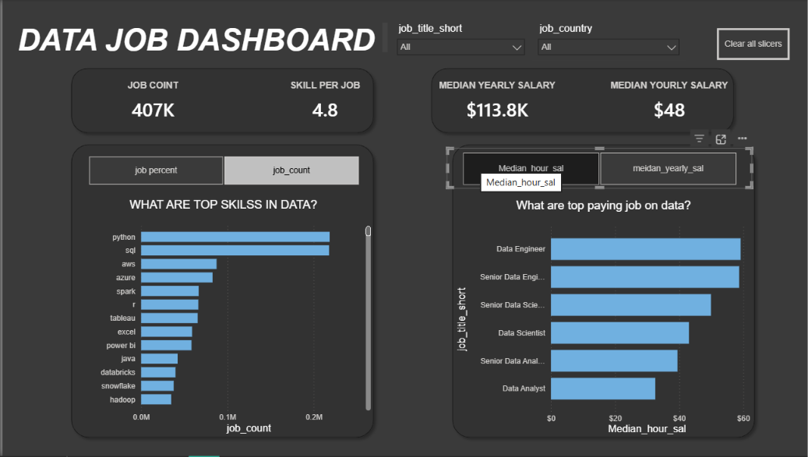

# My Power BI Dashboard Portfolio

This repository is collection of power BI dashboard . I've developed . It tracks my journey using Power BI, from foundational reports to more advanced interactive analyses , all aimed at data turning into clear actionable insights

# Featured Dashboards

Explore the dashboards below. Each has its own dedicated README with more details on the build processand specific features

## Data Job Dashboard (V1 - Comprehensive Exploration)

[ **Key Power bi skills Utilized**]

- Dashboard layout and design
- Power Querry(ETL and Data Shaping)
- Basic Data Modelling (Table Relationship)
- Implicit measure and standard Aggregations
- Core Charts(Bar , Line, Area, Column)
- Map Visiualization for geospatical Data
- KPI Cards and Detailed Data table
- Interactive Slicersfor Filtering
- Buttons &Bookmarks for Page Navigations
- Drill-Through Functionality

[**View Full Project 1 Details (README)**](/Data_Jobs_v1/README.md)

## [DATA JOBS DASHBOARD 2.0] (V2 Single Page Focus)

[ **Key Power bi skills Utilized demonstarting progression**]

- Advance dashboard design (Single Page UX and optimization)

* Complex Power Querry transformations
* Star Schema data modelling principle
* Explicit Dax measures(e.g CALCULATE , context modifiers )
* Dynamic Visualizations (driven by parameter and Slicers)
* Field and numeric Parameter Implementaion for "What If" Analysis
* Enhanced geospatical Insight
* Advanced Card Visualization
* Optimzes Slicers & Advanced Cross-Filtering Techniques
* Report Performance considerations

[**View Full Project 2 Details (README)**](/Data_jobs_v2/README.md)

## About this Portfolio

Each dashboard linked above has its own detailed `README.md` file within its respective project folder. These offer deeper insights into the project objectives, data sources ,specific Power BI techniques employed, and a closer look at the dashboard build.
